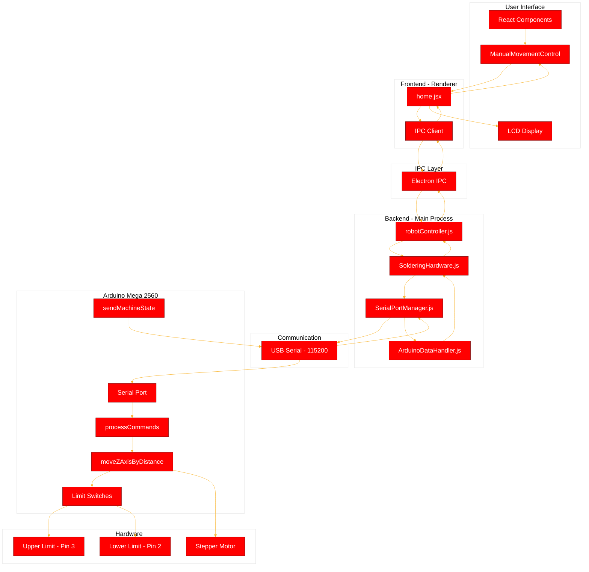
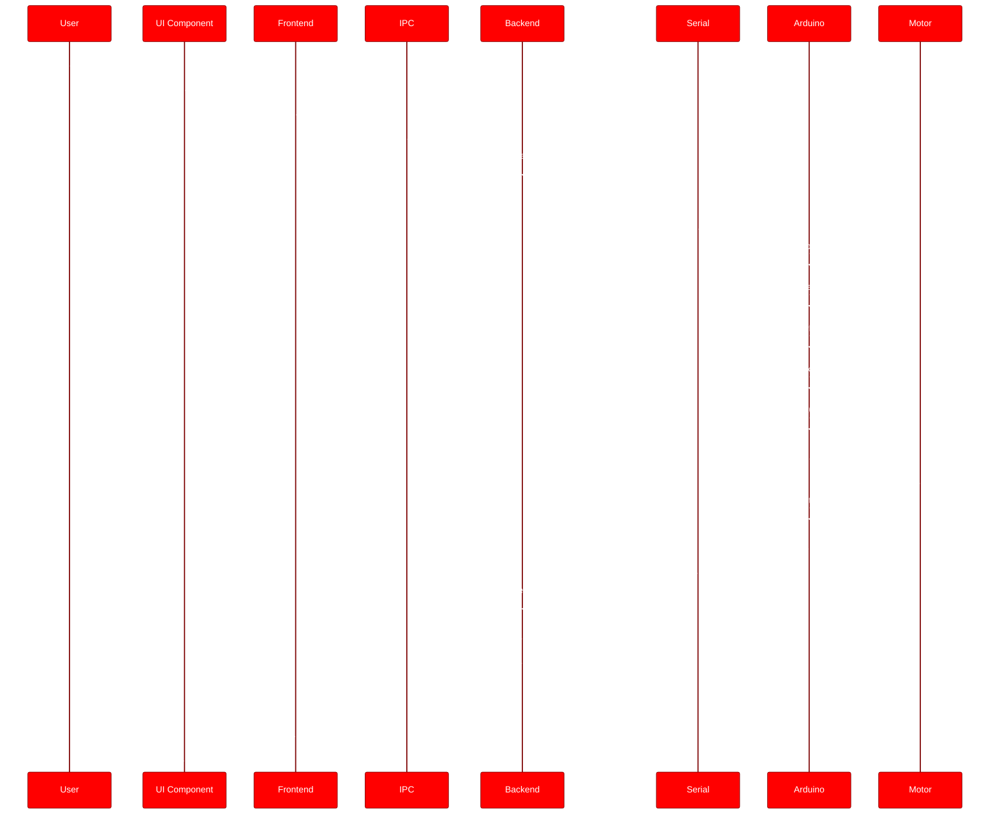
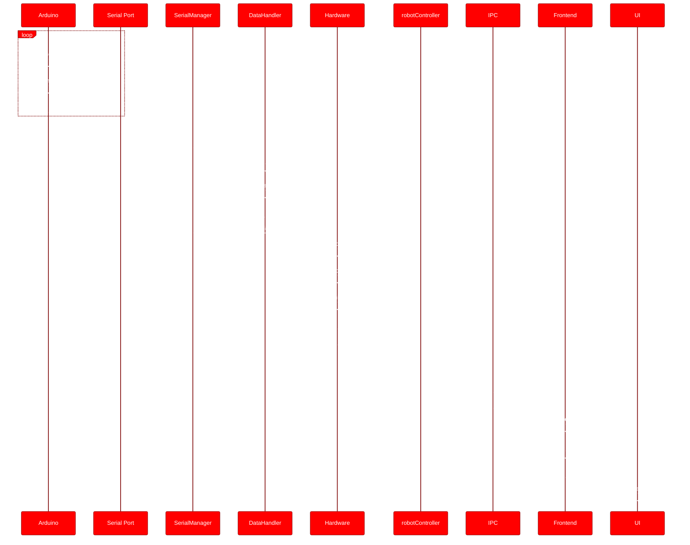
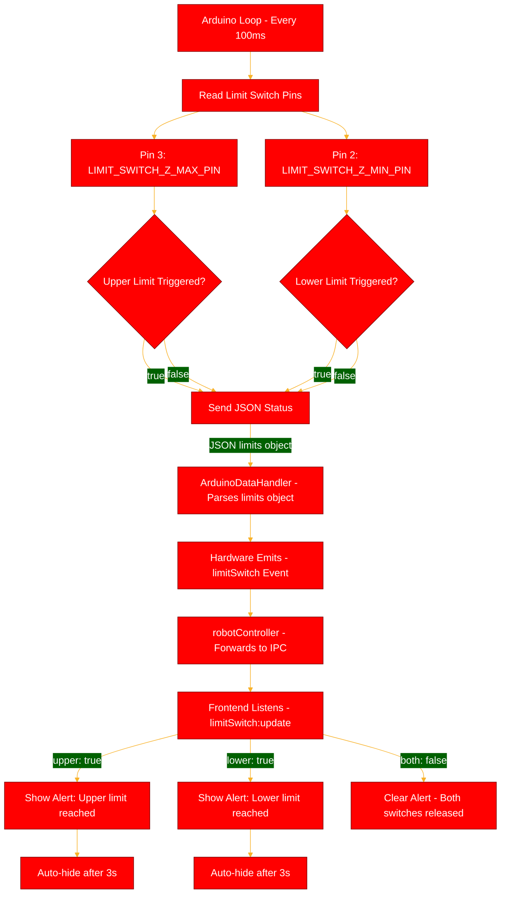
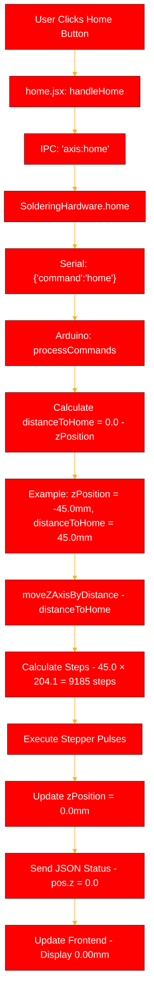
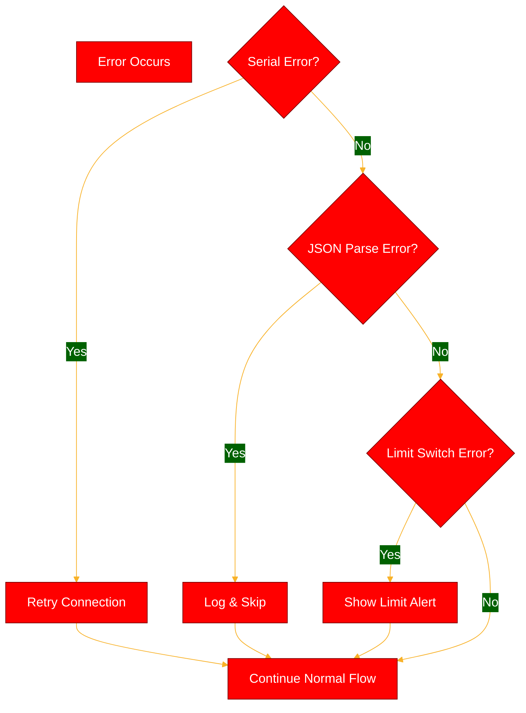

# Complete App Workflow Flowchart

## System Architecture Flow



## Command Flow: User Jog Action



## Data Flow: Arduino Status Updates



## Limit Switch Detection Flow



## Homing Function Flow



## Complete System Interaction Diagram

```mermaid
%%{init: {'themeVariables': {'fontSize': '200px', 'primaryColor': '#000000', 'primaryTextColor': '#ffffff', 'primaryBorderColor': '#ffffff', 'lineColor': '#ffffff', 'secondaryColor': '#000000', 'tertiaryColor': '#000000', 'nodeBkgColor': '#000000', 'mainBkgColor': '#000000', 'textColor': '#ffffff'}}}%%
flowchart TD
    Start([User Interface])
    
    UA["User Actions Section"]
    A1["User clicks Jog Down button"]
    A2["User clicks Jog Up button"]
    A3["User clicks Home button"]
    A4["User sets step size value"]
    
    FP["Frontend Processing Section"]
    B1["home.jsx receives click event"]
    B2["Calculate movement direction"]
    B3["Calculate step distance"]
    B4["Prepare command object"]
    B5["Call window.ipc.send"]
    B6["Send axis:jog event"]
    
    IPC["IPC Communication Layer"]
    IPC1["Electron IPC receives event"]
    IPC2["Route to robotController"]
    
    BP["Backend Processing Section"]
    C1["robotController receives IPC"]
    C2["Call SolderingHardware.jog"]
    C3["Validate command parameters"]
    C4["Calculate final distance"]
    C5["Prepare JSON command"]
    C6["Call SerialPortManager.sendJsonCommand"]
    
    SER["Serial Communication"]
    SER1["Format JSON string"]
    SER2["Add newline character"]
    SER3["Write to USB serial port"]
    SER4["115200 baud rate"]
    
    AP["Arduino Processing Section"]
    D1["Arduino Serial.readString"]
    D2["Read until newline"]
    D3["Parse JSON string"]
    D4["Extract command type"]
    D5["Extract axis parameter"]
    D6["Extract distance value"]
    D7["Call processCommands function"]
    D8["Validate command structure"]
    D9["Check current position"]
    D10["Read limit switch pins"]
    D11["Check upper limit Pin 3"]
    D12["Check lower limit Pin 2"]
    D13["Calculate steps to move"]
    D14["Apply precision rounding"]
    D15["Call moveZAxisByDistance"]
    D16["Execute stepper pulses"]
    D17["Update zPosition variable"]
    D18["Call sendMachineState"]
    
    HE["Hardware Execution Section"]
    E1["Generate stepper pulses"]
    E2["Pulse delay microseconds"]
    E3["Direction pin control"]
    E4["Step pin toggling"]
    E5["Physical motor movement"]
    E6["Mechanical axis movement"]
    
    FB["Feedback Loop Section"]
    F1["Arduino sends JSON status"]
    F2["Serial port receives data"]
    F3["SerialPortManager parses line"]
    F4["ArduinoDataHandler processes"]
    F5["Extract position data"]
    F6["Extract limit switch status"]
    F7["Extract temperature data"]
    F8["Create updates object"]
    F9["Emit arduino:data event"]
    F10["SolderingHardware handles"]
    F11["Update internal state"]
    F12["Emit position:update event"]
    F13["Emit limitSwitch event"]
    F14["robotController forwards"]
    F15["Send IPC to renderer"]
    F16["Frontend receives update"]
    F17["Update React state"]
    F18["Re-render UI components"]
    F19["Display new position"]
    F20["Show limit warnings"]
    
    Start --> UA
    UA --> A1
    UA --> A2
    UA --> A3
    UA --> A4
    
    A1 --> FP
    A2 --> FP
    A3 --> FP
    A4 --> FP
    
    FP --> B1
    B1 --> B2
    B2 --> B3
    B3 --> B4
    B4 --> B5
    B5 --> B6
    B6 --> IPC
    
    IPC --> IPC1
    IPC1 --> IPC2
    IPC2 --> BP
    
    BP --> C1
    C1 --> C2
    C2 --> C3
    C3 --> C4
    C4 --> C5
    C5 --> C6
    C6 --> SER
    
    SER --> SER1
    SER1 --> SER2
    SER2 --> SER3
    SER3 --> SER4
    SER4 --> AP
    
    AP --> D1
    D1 --> D2
    D2 --> D3
    D3 --> D4
    D4 --> D5
    D5 --> D6
    D6 --> D7
    D7 --> D8
    D8 --> D9
    D9 --> D10
    D10 --> D11
    D10 --> D12
    D11 --> D13
    D12 --> D13
    D13 --> D14
    D14 --> D15
    D15 --> D16
    D16 --> HE
    D16 --> D17
    D17 --> D18
    
    HE --> E1
    E1 --> E2
    E2 --> E3
    E3 --> E4
    E4 --> E5
    E5 --> E6
    
    D18 --> FB
    FB --> F1
    F1 --> F2
    F2 --> F3
    F3 --> F4
    F4 --> F5
    F4 --> F6
    F4 --> F7
    F5 --> F8
    F6 --> F8
    F7 --> F8
    F8 --> F9
    F9 --> F10
    F10 --> F11
    F11 --> F12
    F11 --> F13
    F12 --> F14
    F13 --> F14
    F14 --> F15
    F15 --> F16
    F16 --> F17
    F17 --> F18
    F18 --> F19
    F18 --> F20
```



## Key Data Structures

### Command Flow (App → Arduino)
```
User Input: 5mm step size, ↓ button
    ↓
JSON Command: {"command":"jog","axis":"z","distance":-5.0}
    ↓
Serial: '{"command":"jog","axis":"z","distance":-5.0}\n'
    ↓
Arduino Receives: distance = -5.0 (float)
    ↓
Calculates: steps = 5.0 × 204.1 = 1020 steps
    ↓
Executes: 1020 stepper pulses
    ↓
Updates: zPosition = -5.0mm
```

### Status Flow (Arduino → App)
```
Arduino Status: zPosition = -5.0mm, limits = {upper:false, lower:false}
    ↓
JSON: {"pos":{"z":-5.0,"moving":false},"limits":{"upper":false,"lower":false},...}
    ↓
Serial: JSON string + '\n'
    ↓
Parsed: {position: {z: -5.0}, limitSwitches: {upper: false, lower: false}}
    ↓
Events: 'position:update', 'limitSwitch:update'
    ↓
UI Updates: Display -005.00 mm
```

## Component Responsibilities

| Component | Responsibility |
|-----------|---------------|
| **ManualMovementControl** | User input, step size selection, jog buttons |
| **home.jsx** | State management, IPC communication, UI coordination |
| **robotController.js** | IPC event routing, hardware event forwarding |
| **SolderingHardware.js** | Hardware abstraction, command processing, state management |
| **SerialPortManager.js** | Serial port communication, JSON sending/receiving |
| **ArduinoDataHandler.js** | JSON parsing, data structure conversion |
| **Arduino Sketch** | Hardware control, sensor reading, movement execution |

## Communication Protocols

### Command Protocol (App → Arduino)
- Format: JSON string + newline
- Example: `{"command":"jog","axis":"z","distance":-5.0}\n`
- Baud Rate: 115200
- Method: Fire-and-forget (no acknowledgment required)

### Status Protocol (Arduino → App)
- Format: JSON string + newline
- Frequency: Every 100ms
- Example: `{"pos":{"z":-5.0,"moving":false},"limits":{"upper":false,"lower":false},...}\n`
- Parsing: Automatic via ArduinoDataHandler

## Error Handling Flow



